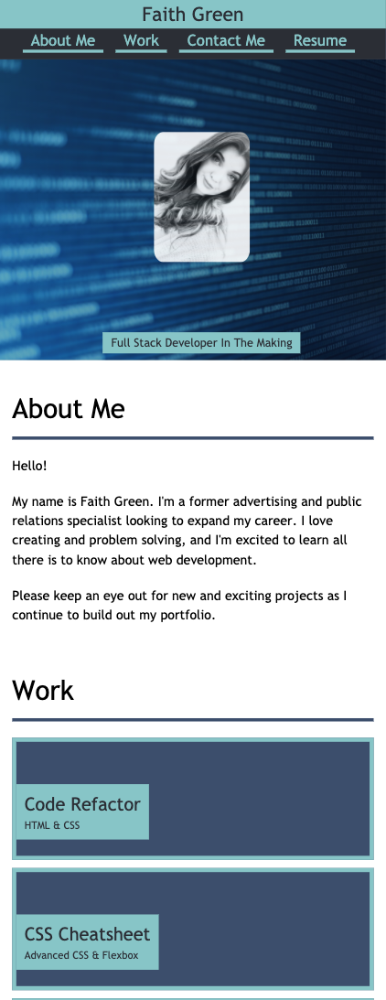
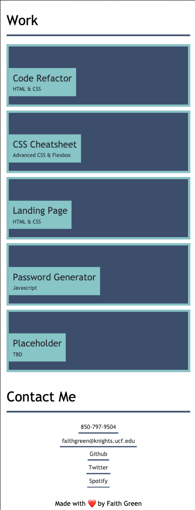
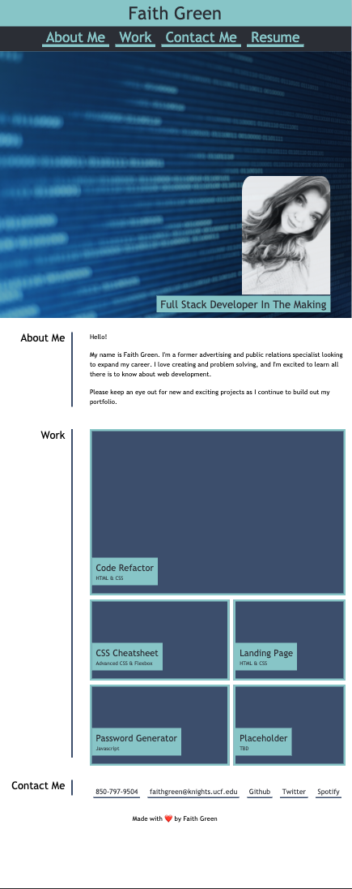
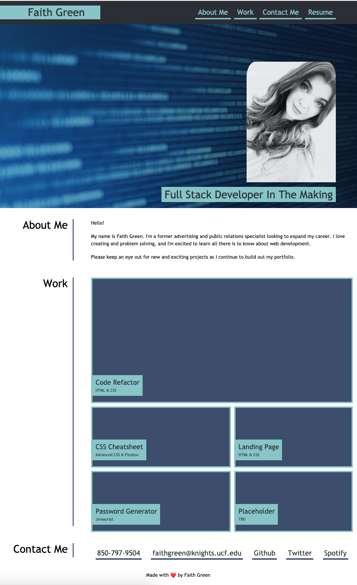

# Advanced CSS Portfolio

**View**: [Live Link](https://faithelizagreen.github.io/advanced-css-portfolio/)

This website is built using advanced CSS techniques such as:

- Flexbox
- Media Queries
- CSS Variables

# Description

For my portfolio website, I used advanced css techniques to create a responsive website that can be viewed on muiltple viewports.

I designed this website using a **mobile first approach** by building out media queries for tablets and desktop screens.

# Visuals

## Mobile View

## Tablet View

## Desktop View

# Credits

**CSS RESET**

- [Murtaugh Github Reset](https://github.com/murtaugh/HTML5-Reset/blob/master/assets/css/reset.css)